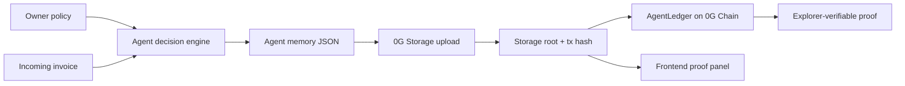

# AgentVault 0G

Self-custodial AI agent billing console with verifiable memory on 0G Storage and on-chain audit proofs on 0G Chain.

## Hackathon Fit

AgentVault targets the 0G APAC Hackathon Track 3: Agentic Economy & Autonomous Applications.

AI agents are starting to buy tools, storage, compute, data, and subscriptions for their users. The missing layer is a policy-bound wallet that can make payment decisions, preserve long-term memory, and leave an auditable trail. AgentVault lets an owner define payment limits, lets an agent evaluate an invoice, writes the decision memory to 0G Storage, and records the storage root on 0G Chain.

## 0G Integration

AgentVault uses two 0G components:

- 0G Storage: stores each agent decision as an immutable memory snapshot using `@0gfoundation/0g-storage-ts-sdk`, `Indexer`, and `MemData`.
- 0G Chain: stores the 0G Storage root and storage transaction hash in `AgentLedger.sol`, giving judges an explorer-verifiable activity trail.

Mainnet defaults follow the 0G docs:

- Chain ID: `16661`
- RPC: `https://evmrpc.0g.ai`
- Storage Indexer: `https://indexer-storage-turbo.0g.ai`
- Explorer: `https://chainscan.0g.ai`

## Architecture



## Local Setup

```bash
npm install
cp .env.example .env
npm run dev
```

Open `http://127.0.0.1:5173`.

Without `ZEROG_PRIVATE_KEY`, the API runs in preview mode and returns deterministic local hashes. Set `ZEROG_PRIVATE_KEY` to perform live 0G Storage uploads.

## Live 0G Submission Flow

1. Add a funded 0G mainnet private key to `.env`.

```bash
ZEROG_PRIVATE_KEY=0x...
ZEROG_RPC_URL=https://evmrpc.0g.ai
ZEROG_INDEXER_RPC=https://indexer-storage-turbo.0g.ai
ZEROG_EXPLORER=https://chainscan.0g.ai
```

2. Deploy the audit contract.

```bash
npm run deploy:0g
```

3. Copy the deployed address into `.env`.

```bash
VITE_AGENT_LEDGER_ADDRESS=0x...
```

4. Start the app.

```bash
npm run dev
```

5. In the app:

- Connect wallet on 0G Mainnet.
- Adjust the agent policy or invoice.
- Upload the memory snapshot to 0G Storage.
- Record the storage root on 0G Chain.
- Use the explorer links as the required proof.

## Useful Commands

```bash
npm run build
npm run contract:compile
npm run upload:sample
npm run deploy:0g
```

## Submission Checklist

- GitHub repository link
- Public frontend URL
- 0G mainnet contract address
- 0G explorer transaction link for `DecisionRecorded`
- 0G Storage transaction/root proof
- Demo video under 3 minutes
- Public X post with `#0GHackathon` and `#BuildOn0G`

## Project Summary

One sentence:

AgentVault is a self-custodial AI payment console that writes every autonomous billing decision to 0G Storage and anchors it on 0G Chain.

Short summary:

AgentVault helps users safely delegate payment approvals to AI agents. The product combines configurable spending policy, deterministic agent decisioning, decentralized memory storage, and an on-chain audit ledger. 0G Storage preserves the full decision context, while 0G Chain records a verifiable pointer to each memory snapshot.

## License

MIT
